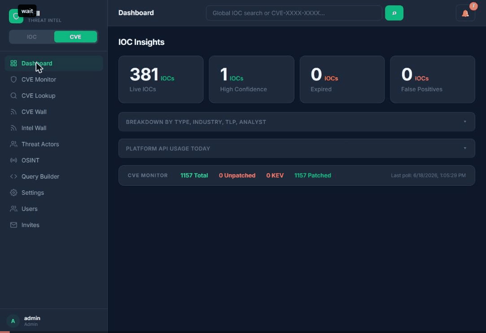

# TFII — ThreatFeed Intelligence Platform

> A small threat intelligence portal trying to mix and merge OpenCTI and OpenCVE but with a pinch of salt.

**IOC management · CVE monitoring · Detection engineering · OSINT · CVE Wall · KQL/SPL builder**

---

## Quick Start

Two paths — pick one:

### 🐳 Docker (recommended — 5 minutes)

```bash
git clone https://github.com/sherifrahim/TFII.git && cd TFII
chmod +x scripts/docker-setup.sh && ./scripts/docker-setup.sh
```

The script creates your `.env`, generates secrets, builds the containers, and opens the platform. Choose HTTP (local/dev) or HTTPS (production — auto Let's Encrypt via Caddy).

### 🔧 Manual (bare metal / existing server)

See [Manual Deployment Guide](#manual-deployment) below.

---

## Screenshots


---

## Features

TFII is organised as an analyst platform rather than a set of admin pages:

| Area | What it does |
|------|-------------|
| **Command Center** | Live metrics with trends and sparklines (active / high-confidence / critical IOCs, new today, CVEs, unpatched, KEV, active campaigns), 30-day IOC activity, Threat Pulse (actively exploited KEV CVEs in your software, malware families with fresh indicators, moving campaigns), type distribution, CVE exposure, top actors & malware, recent intelligence, open investigations and connector health. Everything drills down. |
| **IOC Intelligence** | Server-side paginated analyst table (thousands of rows) with search, type/source/TLP/confidence/time/campaign filters, facets, sorting, bulk actions (add to investigation, assign campaign, tag, mark FP). VirusTotal + AbuseIPDB + URLhaus enrichment, STIX 2.1 export, TAXII 2.1 server, STIX/TAXII/MISP/CSV import. |
| **Entity Intelligence** | One page per indicator: reputation, confidence reasoning, enrichment, provenance, related IOCs (campaign, malware family, /24, shared tags), linked CVEs, interactive relationship graph, observation timeline and notes, generated KQL/SPL/YARA hunting queries, investigations. Untracked values open as observables with reputation lookup. |
| **Relationship graph** | Zoom/pan, node selection and inspection, relationship-type and node-kind filters, expand-in-place, open entity. Used on entities, campaigns, actors, malware, investigations and the Entity Explorer. |
| **CVE Intelligence** | Software view (per-product severity mix, KEV, unpatched, status), CVE view (paginated, filterable), Software Intelligence pages (severity distribution, CVEs by year, EPSS, KEV, affected versions, CWE, references, exposure-hunting queries), multi-source CVE lookup (NVD, CVE.org, OSV, EPSS, KEV, PoCs), CVE reports. NVD polling every 6h. |
| **Threat Actors & Campaigns** | Actors attributed in campaigns, malware families seen in the feed, MITRE ATT&CK profiles, campaign pages with infrastructure graph and activity. |
| **Intel Wall** | One merged feed (news + advisories) classified per item (CVE / APT / Ransomware / Malware / Vulnerability / IOC), severity from content, extracted CVE and actor entities, and an “Affects my software” cross-reference with your monitored assets. |
| **Global Search / Command palette** | `Ctrl+K` anywhere: indicators, CVEs, software, actors, malware, campaigns, investigations, notes, recent entities/searches and actions (Add IOC, Create Investigation, Bulk Lookup, …). |
| **Workspace** | Investigations with IOCs (tracked or untracked observables), infrastructure graph, saved queries/detections, timeline, notes, artifacts and Markdown report export — plus the original notes/checklists board. |
| **OSINT Toolkit** | IOC lookup (DNS/RDAP/Shodan/HIBP), bulk IOC lookup, URL decoder, Safe Link extractor, User-Agent parser, redirect tracer, diff checker. |
| **Notifications** | Grouped Critical / Intelligence / System centre; connector failures raise System notifications; every item links to where to act. |
| **Platform** | Health, connectors (ThreatFox, MalwareBazaar, URLhaus), API usage, users/permissions/invites, settings, owner file store. |

---

## Architecture

```
frontend/src
  App.js            entry → Root.js (auth, session, hash routing)
  shell/            sidebar, top bar, command palette, notification centre, nav IA
  pages/            Command Center, IOCs, Entity, CVE/Software, Actors, Campaigns,
                    Intel Wall, Search/Explorer, OSINT, Workspace, Platform
  components/       design-system primitives, charts, relationship graph, icons
  design/           tfii.css (tokens + components), tokens.js
  legacy/           the original, working tools, rendered inside the new shell
backend
  main.py           FastAPI app, auth/capabilities, v1 API, connectors, schedulers
  security.py       SSRF-safe HTTP client, URL/domain validators, security headers
  migrations.py     numbered, additive schema migrations
  entities.py       entity headers, relationship engine, provenance, timelines
  search.py         provider-based global search
  entity_api.py     /v2/entity*, /v2/search, relationships, workspace bridge
  intel_api.py      /v2 API: paginated IOCs + facets, command centre, software,
                    investigations, intel wall, notifications, API usage
  tests/            pytest suite (own throwaway PostgreSQL database)
```

The v1 API is unchanged; `/v2/*` is additive. Schema migrations are additive and
run at startup. The data, entity, relationship and provenance models, the search
architecture, endpoints and known limitations are documented in
[docs/INTELLIGENCE_CORE.md](docs/INTELLIGENCE_CORE.md).

### Local development

```bash
# backend
python3 -m venv venv && . venv/bin/activate && pip install -r backend/requirements.txt
export DB_HOST=localhost DB_NAME=threatfeeddb DB_USER=threatfeed DB_PASS=… SECRET_KEY=…
cd backend && uvicorn main:app --port 8000

# frontend (config.js falls back to the page origin; point it at the API for dev)
cd frontend && npm ci --legacy-peer-deps
sed -i 's|https://YOUR_DOMAIN|http://localhost:8000|' src/config.js   # don't commit this
CI=true GENERATE_SOURCEMAP=false npm run build

# tests (backend creates/drops its own database; frontend: lint + unit)
cd backend && pip install -r requirements-dev.txt && python -m pytest
cd frontend && npx eslint src --ext .js --max-warnings 0 && CI=true npm test
```

---

## Infrastructure (all free)

| Component | Free tier |
|-----------|-----------|
| Compute | Oracle Cloud ARM VM — 4 OCPU, 24GB RAM, permanent free |
| NVD | CVE database API — free with registration |
| CISA KEV | Known exploited vulnerabilities — free JSON feed |
| EPSS | Exploitation probability — free API from FIRST.org |
| MITRE ATT&CK | Threat actor data — free open-source CTI dataset |
| Groq (LLaMA 3.3 70B) | KQL/SPL generation — 14,400 free requests/day |
| URLhaus | Abuse.ch IOC feeds — free API |

**Monthly cost: $0**

---

## Docker Deployment

### Prerequisites
- Docker Engine 24+ and Docker Compose v2
- A domain pointing to your server (for HTTPS)
- Ports 80/443 open (HTTPS) or just 80 (HTTP)

### One-command setup
```bash
./scripts/docker-setup.sh
```

### Manual Docker steps
```bash
# 1. Copy and configure environment
cp .env.example .env
nano .env          # Set DOMAIN, DB_PASS, and generate SECRET_KEY

# 2. Build and start (HTTP)
docker compose up -d --build

# 3. With auto-HTTPS (requires domain → server)
docker compose -f docker-compose.yml -f docker-compose.https.yml up -d --build
```

### Common Docker commands
```bash
docker compose logs -f backend      # Backend logs
docker compose ps                   # Service status
docker compose down                 # Stop
docker compose pull && docker compose up -d   # Update
docker compose exec postgres psql -U threatfeed threatfeeddb   # DB access
```

---

## Manual Deployment

Tested on Ubuntu 22.04. Requires: Python 3.10+, Node.js 20+, PostgreSQL 15+, Nginx.

### 1. System setup
```bash
sudo apt update && sudo apt install -y python3-pip python3-venv nodejs npm nginx certbot python3-certbot-nginx postgresql
```

### 2. Database
```bash
sudo -u postgres psql -c "CREATE USER threatfeed WITH PASSWORD 'your_password';"
sudo -u postgres psql -c "CREATE DATABASE threatfeeddb OWNER threatfeed;"
```

### 3. Backend
```bash
git clone https://github.com/sherifrahim/TFII.git /opt/tfii
cd /opt/tfii
python3 -m venv venv && source venv/bin/activate
pip install -r backend/requirements.txt

cp .env.example .env
nano .env    # Fill in all values

# systemd service
sudo cp scripts/threatfeed.service /etc/systemd/system/
sudo systemctl enable --now threatfeed
```

### 4. Frontend
```bash
cd /opt/tfii/frontend-ui    # or wherever your CRA project lives
# Substitute domain into App.js
sed "s|YOUR_DOMAIN|your-domain.com|g" /opt/tfii/frontend/src/App.js > src/App.js
npm install && npm run build
```

### 5. Nginx + HTTPS
```bash
sudo certbot --nginx -d your-domain.com
# Configure nginx to serve /ui/ from the React build and proxy / to port 8000
```

---

## Environment Variables

| Variable | Required | Description |
|----------|----------|-------------|
| `DOMAIN` | ✓ | Your domain (e.g. `tfii.example.com`) |
| `DB_HOST` | ✓ | `postgres` (Docker) or `localhost` (manual) |
| `DB_NAME` | ✓ | Database name (default: `threatfeeddb`) |
| `DB_USER` | ✓ | Database user |
| `DB_PASS` | ✓ | Database password |
| `SECRET_KEY` | ✓ | JWT signing key — generate with `python3 -c "import secrets; print(secrets.token_hex(32))"` |
| `ALLOWED_ORIGINS` | ✓ | `https://your-domain.com` |
| `ENCRYPTION_KEY` | ✓ | Fernet key for stored API keys |
| `GROQ_API_KEY` | Optional | KQL/SPL query builder ([console.groq.com](https://console.groq.com)) |
| `VT_API_KEY` | Optional | VirusTotal enrichment |
| `ABUSEIPDB_API_KEY` | Optional | AbuseIPDB enrichment |
| `NVD_API_KEY` | Optional | Higher NVD rate limits ([nvd.nist.gov/developers](https://nvd.nist.gov/developers)) |
| `SHODAN_API_KEY` | Optional | Shodan OSINT |
| `HIBP_API_KEY` | Optional | HaveIBeenPwned email lookup |

---

## Default Credentials

| | |
|-|-|
| Username | `admin` |
| Password | `TFeed@99` |

**Change the password immediately** — Settings → Change Password.

**Signup is open** — anyone can sign up and explore the tool in demo/explorer mode (CVE Lookup, KQL/SPL builder, OSINT, CVE Wall, Bulk IOC Lookup). The personal IOC feed, CVE Monitor, and Campaigns are invite-only. Explorers can request full access from within the app; you'll get a push notification (if configured) and can approve or deny from Settings → Access Requests.

This will be changed to a public facing IOC and CVE feed very soon enough.

---

## Security Notes

- Signup: an invite code grants the role it was issued for; open signup (no code) only ever yields the restricted *explorer* role (no indicator database)
- Rate limiting: login 10/min, signup 5/hr
- Per-user API keys encrypted
- Port 8000 (backend) not exposed externally — Nginx/Caddy proxies everything
- OTX (optional): set `OTX_API_KEY` or save a key under Settings → Manage API Keys to enable the AlienVault OTX feed
- Scrub your deployment of any secrets before sharing: `git-filter-repo --replace-text replacements.txt`

---

## Contributing

Issues and PRs welcome. If you find a bug or have a feature idea, open an issue.

---

## License

MIT
