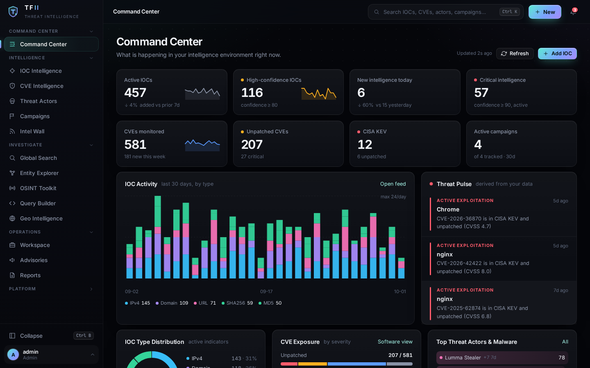
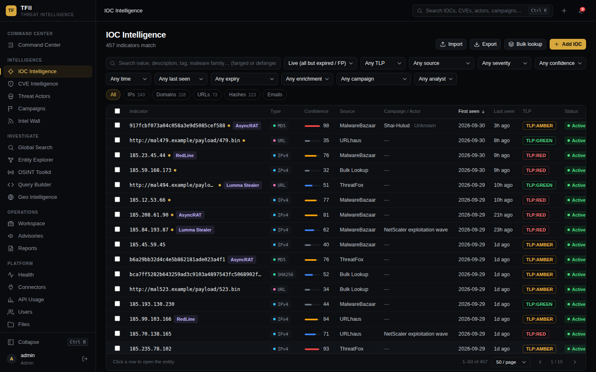
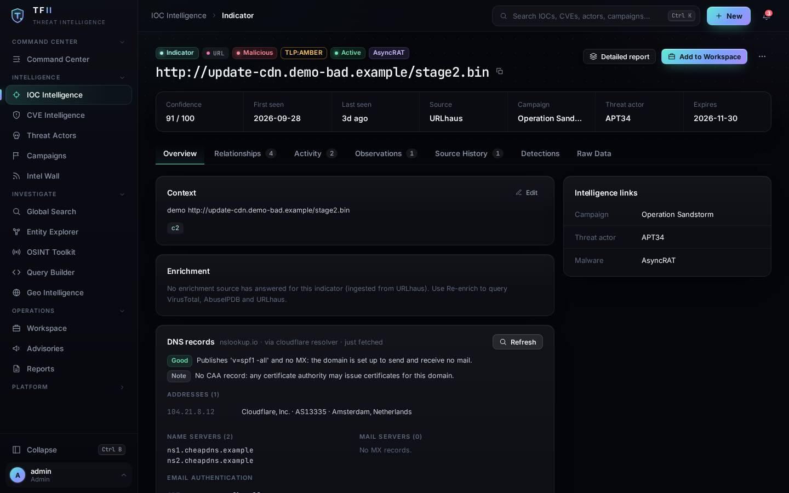
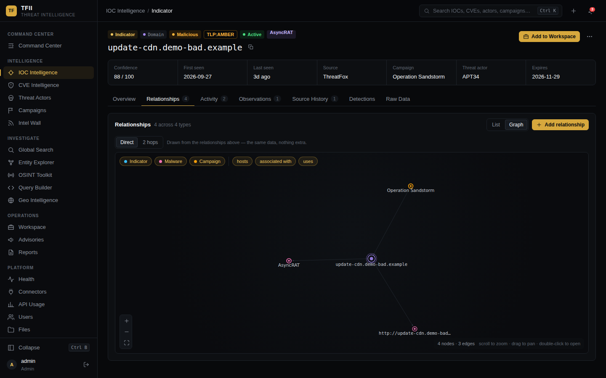
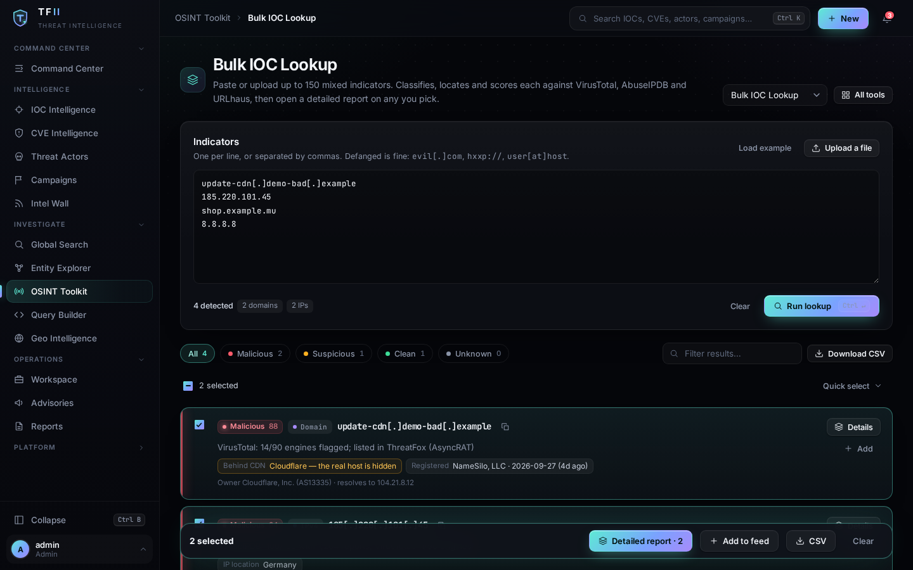
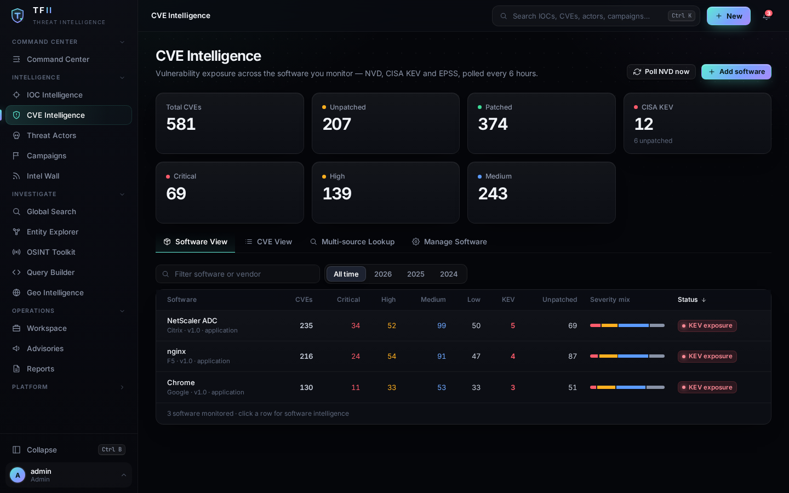
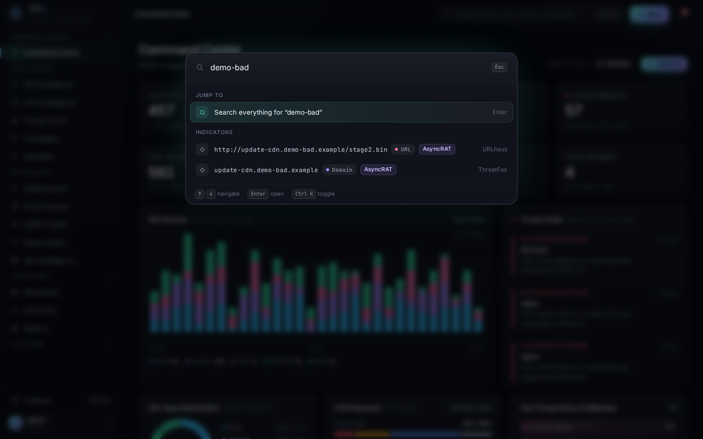

# TFII — ThreatFeed Intelligence Platform

**Threat intelligence that shows its work.** A self-hosted, open-source platform that pulls public threat feeds and CVE data into one analyst workspace, and tells you *why* it believes what it says: which sources agree, how confident it is, and what a location actually means.

[](https://github.com/sherifrahim/TFII/actions/workflows/ci.yml)
[](LICENSE)




<sub>Screenshots in this README use seeded demo data, not a live feed.</sub>

## Why TFII

Most small teams cannot run a full threat-intel platform, and most free feeds are just lists of things to block. TFII sits between the two: a single self-hosted app for triage and investigation that stays honest about uncertainty.

- **Corroborated confidence, not a single score from a single feed.** Each source has a reliability. Independent sources combine, and an aggregator (IPsum) is never double-counted against the lists it aggregates. Every indicator page shows the reasoning.
- **Honest location.** A domain behind a CDN does not get a country pinned on it. TFII labels what each fact is: *IP location*, *hosted in*, *CDN edge node* (follows the asker, says nothing about the origin), *TLD registry*, *registrant country*, plus VirusTotal's *past addresses* to see behind a CDN.
- **Bring your own keys, per user.** API keys are encrypted at rest, only visible to the account that saved them, and have a **Test** button so you know a key works before you rely on it.
- **Triage in bulk.** Paste up to 150 IOCs (defanged `hxxp://evil[.]com` is fine), get enrichment, location and DNS context, export CSV.
- **No telemetry, no cloud dependency.** It runs on your box. See exactly what leaves it in [docs/DATA_FLOWS.md](docs/DATA_FLOWS.md).

## Screenshots

| | |
|---|---|
|  **IOC Intelligence** — filter, facet, bulk-act |  **One page per indicator** — reasoning, enrichment, DNS records |
|  **Relationship graph** |  **Bulk lookup** — 150 at a time, CSV export |
|  **CVE Intelligence** — KEV, EPSS, your software |  **Ctrl+K** — search everything |

## Quick Start

You need Docker with Compose v2 and a machine with ports 80/443 (or just 80 for a local trial).

```bash
git clone https://github.com/sherifrahim/TFII.git && cd TFII
chmod +x scripts/docker-setup.sh && ./scripts/docker-setup.sh
```

The script creates your `.env`, generates the secrets **and a one-off admin password**, builds the containers and starts the platform. Choose HTTP (local trial) or HTTPS (public: automatic Let's Encrypt through Caddy). Manual setup is described in [Manual Deployment](#manual-deployment).

### First login

There is no default password. Username `admin`; the password is the `ADMIN_INITIAL_PASSWORD` line the setup script wrote to `.env` (and printed at the end). If you set that variable yourself it is used as-is; if you leave it blank the backend generates a random one on first start and prints it **once** in its log:

```bash
docker compose logs backend | grep "First-run admin"
```

Change it right away under Settings → Change Password. Free public feeds (Feodo Tracker, OpenPhish, Phishing.Database, IPsum, CINS, Emerging Threats, blocklist.de, NVD, CISA KEV, EPSS) work without any key; add keys for VirusTotal, AbuseIPDB, abuse.ch and OTX under Settings → Manage API Keys for richer enrichment.

## What you get

| Area | What it does |
|------|-------------|
| **Command Center** | Live metrics and trends (IOCs, high-confidence, new today, CVEs, unpatched, KEV, campaigns), Threat Pulse (actively exploited CVEs in *your* software, malware families with fresh indicators), connector health. Everything drills down. |
| **IOC Intelligence** | Server-side paginated table (thousands of rows), search, type/source/TLP/confidence/time filters, facets, bulk actions, STIX 2.1 export, TAXII 2.1 server, STIX/TAXII/MISP/CSV import. |
| **Multi-source feeds** | Feodo Tracker, OpenPhish, Phishing.Database, IPsum, CINS Army, Emerging Threats, blocklist.de, AlienVault OTX, and abuse.ch ThreatFox, MalwareBazaar and URLhaus. Per-source reliability, expiry, and consensus rules. |
| **Entity Intelligence** | One page per indicator: reputation, confidence reasoning, VirusTotal / AbuseIPDB / URLhaus enrichment, provenance, related IOCs, linked CVEs, relationship graph, timeline, notes, generated KQL / SPL / YARA hunting queries. |
| **Email addresses** | Judged through their domain (reputation, age, MX / SPF / DMARC, disposable and free-mail detection), with on-request breach exposure (XposedOrNot) and address risk (IPQualityScore, your own key). Works in bulk lookup too. |
| **DNS records** | Name servers, mail servers, TXT, CAA and SOA for a domain, with SPF and DMARC parsed and flagged — via the public NSLookup.io API, cached, rate-limited. |
| **CVE Intelligence** | Per-product severity mix, KEV, EPSS, affected versions, multi-source lookup (NVD, CVE.org, OSV, exploit references), reports. NVD is polled every 6 hours. |
| **Actors & campaigns** | MITRE ATT&CK actor profiles, campaign pages with an infrastructure graph. |
| **Intel Wall** | News and advisories merged into one classified feed, with an "Affects my software" cross-reference to your monitored assets. |
| **Workspace** | Investigations (tracked or untracked observables), notes, saved queries, Markdown report export. |
| **OSINT toolkit** | IOC lookup (DNS / RDAP / Shodan), bulk lookup, URL decoder, safe-link extractor, redirect tracer, diff checker. |
| **Ctrl+K** | Global search and command palette across everything above. |

More detail on the data model, confidence and provenance: [docs/INTELLIGENCE_CORE.md](docs/INTELLIGENCE_CORE.md).

## What TFII is not

Being clear about scope saves everyone time:

- It is **not** a replacement for a SIEM, EDR or a paid commercial intelligence service. It does not see your network.
- Public feeds are noisy. Confidence scores are a triage aid based on source agreement, not a verdict.
- No independent security audit has been done ([SECURITY.md](SECURITY.md)). Run it behind HTTPS and keep the backend port unexposed.
- A country next to an indicator is never proof of where an attacker sits, and TFII will say so rather than guess.

## Architecture

```
frontend/src
  App.js            entry → Root.js (auth, session, hash routing)
  shell/            sidebar, top bar, command palette, notification centre, nav IA
  pages/            Command Center, IOCs, Entity, CVE/Software, Actors, Campaigns,
                    Intel Wall, Search/Explorer, OSINT, Workspace, Platform
  components/       design-system primitives, charts, relationship graph, icons
  design/           tfii.css (tokens + components), tokens.js
  legacy/           the original, working tools, rendered inside the new shell
backend
  main.py           FastAPI app, auth/capabilities, v1 API, connectors, schedulers
  feeds.py          multi-source feed parsers, reliability and consensus rules
  geo.py            honest, labelled location facts
  dnsintel.py       DNS record enrichment with throttle and cache
  keycheck.py       API-key validity checks
  security.py       SSRF-safe HTTP client, URL/domain validators, security headers
  migrations.py     numbered, additive schema migrations
  entities.py       entity headers, relationship engine, provenance, timelines
  search.py         provider-based global search
  entity_api.py     /v2/entity*, /v2/search, relationships, workspace bridge
  intel_api.py      /v2 API: paginated IOCs + facets, command centre, software, intel wall
  tests/            pytest suite (own throwaway PostgreSQL database)
```

The v1 API is unchanged; `/v2/*` is additive. Schema migrations are additive and run at startup.

### Local development

```bash
# backend
python3 -m venv venv && . venv/bin/activate && pip install -r backend/requirements.txt
export DB_HOST=localhost DB_NAME=threatfeeddb DB_USER=threatfeed DB_PASS=… SECRET_KEY=…
cd backend && uvicorn main:app --port 8000

# frontend (config.js falls back to the page origin; point it at the API for dev)
cd frontend && npm ci --legacy-peer-deps
sed -i 's|https://YOUR_DOMAIN|http://localhost:8000|' src/config.js   # don't commit this
CI=true GENERATE_SOURCEMAP=false npm run build

# tests (backend creates/drops its own database; frontend: lint + unit)
cd backend && pip install -r requirements-dev.txt && python -m pytest
cd frontend && npx eslint src --ext .js --max-warnings 0 && CI=true npm test
```

## Cost

TFII itself is free. It runs comfortably on a small VM (an Oracle Cloud always-free ARM instance is enough) and every default data source is free: NVD, CISA KEV, EPSS, MITRE ATT&CK, the public blocklists above, and abuse.ch with a free Auth-Key. Optional keys (VirusTotal, AbuseIPDB, Shodan, Groq for the query builder, OTX) are yours and stay within your own quotas. Check each provider's terms for your use — see [docs/DATA_FLOWS.md](docs/DATA_FLOWS.md).

---

## Docker Deployment

### Prerequisites
- Docker Engine 24+ and Docker Compose v2
- A domain pointing to your server (for HTTPS)
- Ports 80/443 open (HTTPS) or just 80 (HTTP)

### One-command setup
```bash
./scripts/docker-setup.sh
```

### Manual Docker steps
```bash
# 1. Copy and configure environment
cp .env.example .env
nano .env          # Set DOMAIN, DB_PASS, SECRET_KEY, ENCRYPTION_KEY (ADMIN_INITIAL_PASSWORD may stay blank)

# 2. Build and start (HTTP)
docker compose up -d --build

# 3. With auto-HTTPS (requires domain → server)
docker compose -f docker-compose.yml -f docker-compose.https.yml up -d --build
```

### Common Docker commands
```bash
docker compose logs -f backend      # Backend logs
docker compose ps                   # Service status
docker compose down                 # Stop
docker compose pull && docker compose up -d   # Update
docker compose exec postgres psql -U threatfeed threatfeeddb   # DB access
```

---

## Manual Deployment

Tested on Ubuntu 22.04. Requires: Python 3.10+, Node.js 20+, PostgreSQL 15+, Nginx.

### 1. System setup
```bash
sudo apt update && sudo apt install -y python3-pip python3-venv nodejs npm nginx certbot python3-certbot-nginx postgresql
```

### 2. Database
```bash
sudo -u postgres psql -c "CREATE USER threatfeed WITH PASSWORD 'your_password';"
sudo -u postgres psql -c "CREATE DATABASE threatfeeddb OWNER threatfeed;"
```

### 3. Backend
```bash
git clone https://github.com/sherifrahim/TFII.git /opt/tfii
cd /opt/tfii
python3 -m venv venv && source venv/bin/activate
pip install -r backend/requirements.txt

cp .env.example .env
nano .env    # Fill in all values

# systemd service
sudo cp scripts/threatfeed.service /etc/systemd/system/
sudo systemctl enable --now threatfeed
```

### 4. Frontend
```bash
cd /opt/tfii/frontend-ui    # or wherever your CRA project lives
# Substitute domain into App.js
sed "s|YOUR_DOMAIN|your-domain.com|g" /opt/tfii/frontend/src/App.js > src/App.js
npm install && npm run build
```

### 5. Nginx + HTTPS
```bash
sudo certbot --nginx -d your-domain.com
# Configure nginx to serve /ui/ from the React build and proxy / to port 8000
```

---

## Environment Variables

| Variable | Required | Description |
|----------|----------|-------------|
| `DOMAIN` | ✓ | Your domain (e.g. `tfii.example.com`) |
| `DB_HOST` | ✓ | `postgres` (Docker) or `localhost` (manual) |
| `DB_NAME` | ✓ | Database name (default: `threatfeeddb`) |
| `DB_USER` | ✓ | Database user |
| `DB_PASS` | ✓ | Database password |
| `SECRET_KEY` | ✓ | JWT signing key — generate with `python3 -c "import secrets; print(secrets.token_hex(32))"` |
| `ALLOWED_ORIGINS` | ✓ | `https://your-domain.com` |
| `ENCRYPTION_KEY` | ✓ | Fernet key for stored API keys |
| `ADMIN_INITIAL_PASSWORD` | Optional | Password of the first admin. Blank = a random one is generated and printed once in the backend log (see [First login](#first-login)) |
| `IPQS_API_KEY` | Optional | IPQualityScore email address risk (on request) |
| `GROQ_API_KEY` | Optional | KQL/SPL query builder ([console.groq.com](https://console.groq.com)) |
| `VT_API_KEY` | Optional | VirusTotal enrichment |
| `OTX_API_KEY` | Optional | AlienVault OTX pulses feed |
| `URLHAUS_AUTH_KEY` | Optional | abuse.ch Auth-Key (URLhaus, ThreatFox, MalwareBazaar) — free from [auth.abuse.ch](https://auth.abuse.ch/) |
| `ABUSEIPDB_API_KEY` | Optional | AbuseIPDB enrichment |
| `NVD_API_KEY` | Optional | Higher NVD rate limits ([nvd.nist.gov/developers](https://nvd.nist.gov/developers)) |
| `SHODAN_API_KEY` | Optional | Shodan OSINT |

---

## Security Notes

- Signup: an invite code grants the role it was issued for; open signup (no code) only ever yields the restricted *explorer* role (no indicator database).
- Rate limiting: login 10/min, signup 5/hr.
- Per-user API keys are encrypted at rest and are only readable by their owner (an admin's pooled fallback is per-user and explicit).
- Port 8000 (backend) is not exposed externally — Nginx/Caddy proxies everything.
- OTX (optional): set `OTX_API_KEY` or save a key under Settings → Manage API Keys to enable the AlienVault OTX feed.
- Found a vulnerability? Please report it privately — see [SECURITY.md](SECURITY.md).

## Contributing

Issues and PRs are welcome — see [CONTRIBUTING.md](CONTRIBUTING.md). Good first contributions: a new feed parser (a feed is a URL, a parser and a reliability in `backend/feeds.py`), an offline GeoIP source, or a docs fix.

## Disclaimer

TFII is an independent project. It is not affiliated with or endorsed by MITRE, NIST, CISA, VirusTotal, AbuseIPDB, abuse.ch, AlienVault, or any other data provider named here. This product uses data from the NVD API but is not endorsed or certified by the NVD. All names and marks belong to their owners.

## License

[MIT](LICENSE)
